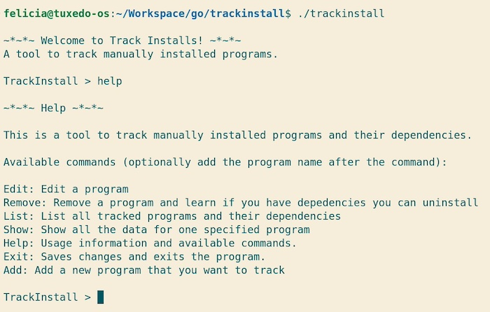

# TrackInstall

A CLI to track manually installed programs/apps and their dependencies. In a future update, it will be possible to add install and uninstall instructions.

Have trouble keeping track of the packages you manually install with your package manager? Do you want to avoid your OS slowly bloating due to them? TrackInstall is the place you can save this information so that you know when you can move those packages to auto so your package manager can work its magic.

In a future update, you will be able to add install steps as well as uninstall steps, so you can track folders and other files to delete when uninstalling a manually installed program.

This project's intial MVP was completed during a [boot.dev](https://boot.dev) hackathon in [July 2025](https://blog.boot.dev/news/hackathon-2025/). I created it so I could track manually installed programs on my own Linux machiness.

## Usage

Install the project by:
```
git clone https://github.com/FeliciaFredlund/trackinstall
cd trackinstall
```

Run it with:
```
go build
./trackinstall
```

For the Hackathon an examples folder comes with, that has a sample data file with already some fake programs added. To use it as your data file, put in these commands before starting it:
```
mv example/EXAMPLE-ti_data.json ti_data.json 
```

## Screenshots
Opening screen as well as what the help command looks like:


Adding a program and also the show command that shows one chosen program:


What deleting a program looks like:


## Change log

Version 1.0 - 2025-07-27

## Future plans

### New additions planned
1. Add the ability (aka fix the bug) that when editing names of programs you can't fix capitalization mistakes if the name is exactly the same otherwise
2. Add the ability to add/edit/remove install and uninstall instructions to each program.
3. Add the ability to overwrite an existing program while adding/editing a program.
4. Add the option to pick the path and filename for the data file. This should also allow placing the binary file wherever. Option would be to add a config file (to save the file path) or some other option.
5. Add what package manager is used (needs some way to save that, config file like filepath?), and have the tool give the commands for installing dependencies and removing/changing them to auto when no longer needed. (Or give the option to have this.)
6. List dependencies and what programs are dependent on them.
7. Add ability to exit out of adding/editing/removing mode.
8. Add short versions of commands: ls for list, rm for remove.
9.  Change help command so it prints the commands in the same order every time

### Refactor plans
- newProgram also adds the program to the map of programs, meaning that have to be sent in too. (This is to avoid inconsistency in how program names as keys get processed. But I still need to remember to strings.ToLower any time I check the map)
- The depedency struct should hold a slice of *program instead of a slice of programNames
- Change edit function so the switch statement use Go const iota or change it some other way
- Divide files. Aka break up command file perhaps to put each command in their own file, and have the main command file have the helper functions